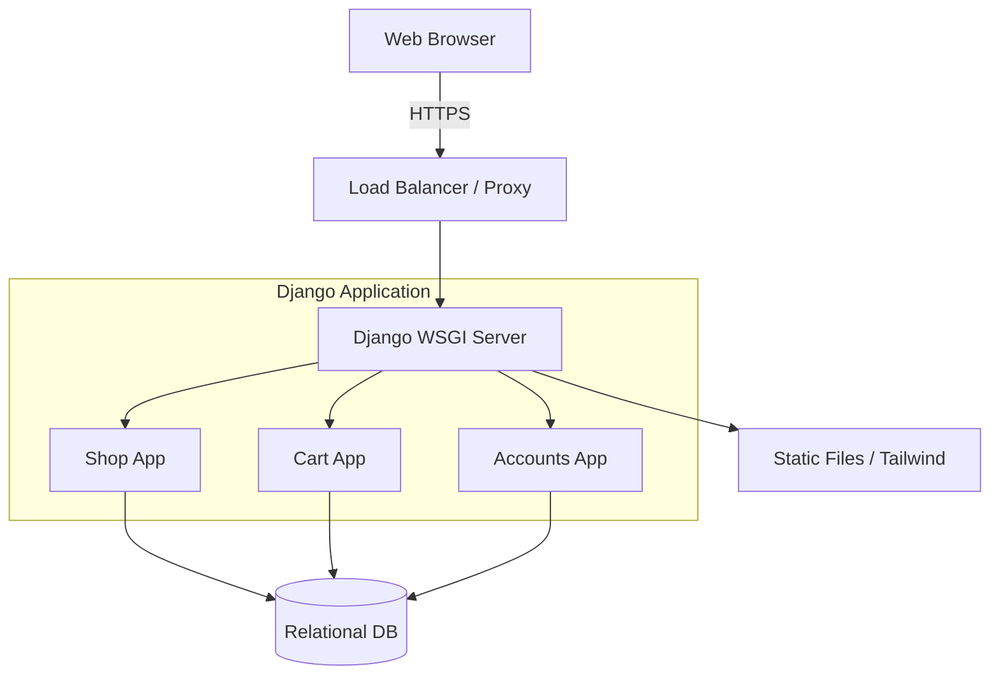
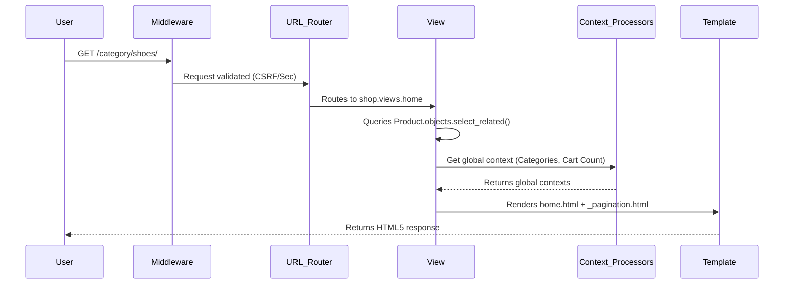
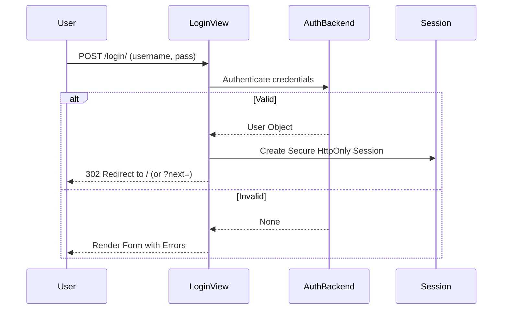
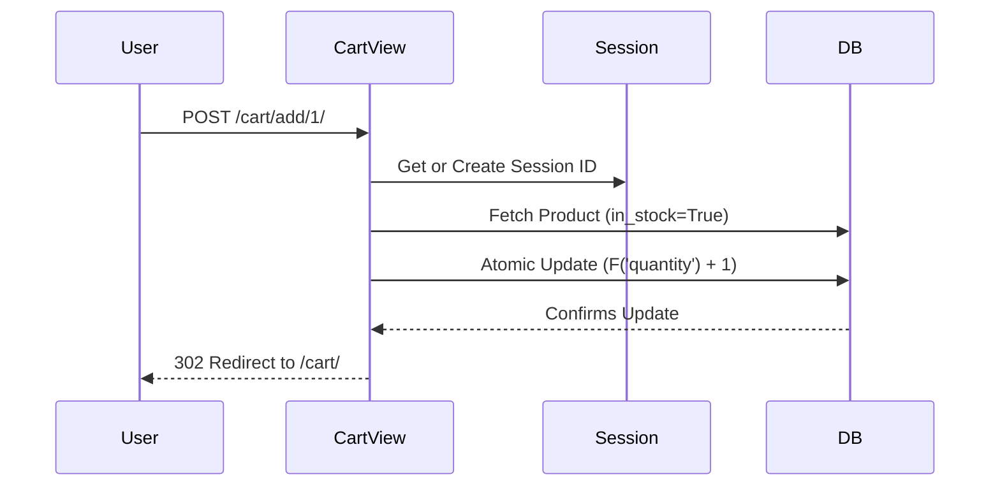

# 🏛️ Architecture & Workflows

## Overall Architecture

```mermaid
graph TD
    Client[Web Browser] --> |HTTPS| LB[Load Balancer / Proxy]
    LB --> App[Django WSGI Server]
    
    subgraph Django Application
        App --> Auth[Accounts App]
        App --> Shop[Shop App]
        App --> Cart[Cart App]
    end
    
    Shop --> DB[(Relational DB)]
    Cart --> DB
    Auth --> DB
    
    App --> Static[Static Files / Tailwind]
```

## Django Request Flow

```mermaid
sequenceDiagram
    participant User
    participant Middleware
    participant URL_Router
    participant View
    participant Context_Processors
    participant Template

    User->>Middleware: GET /category/shoes/
    Middleware->>URL_Router: Request validated (CSRF/Sec)
    URL_Router->>View: Routes to shop.views.home
    View->>View: Queries Product.objects.select_related()
    View->>Context_Processors: Get global context (Categories, Cart Count)
    Context_Processors-->>View: Returns global contexts
    View->>Template: Renders home.html + _pagination.html
    Template-->>User: Returns HTML5 response
```

## Authentication Flow

```mermaid
sequenceDiagram
    participant User
    participant LoginView
    participant AuthBackend
    participant Session

    User->>LoginView: POST /login/ (username, pass)
    LoginView->>AuthBackend: Authenticate credentials
    alt Valid
        AuthBackend-->>LoginView: User Object
        LoginView->>Session: Create Secure HttpOnly Session
        LoginView-->>User: 302 Redirect to / (or ?next=)
    else Invalid
        AuthBackend-->>LoginView: None
        LoginView-->>User: Render Form with Errors
    end
```

## Shopping Cart Flow

```mermaid
sequenceDiagram
    participant User
    participant CartView
    participant Session
    participant DB

    User->>CartView: POST /cart/add/1/
    CartView->>Session: Get or Create Session ID
    CartView->>DB: Fetch Product (in_stock=True)
    CartView->>DB: Atomic Update (F('quantity') + 1)
    DB-->>CartView: Confirms Update
    CartView-->>User: 302 Redirect to /cart/
```
