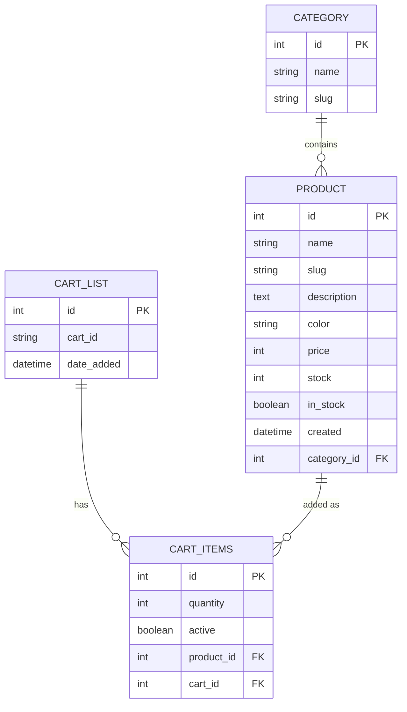

# 🗄️ Database Architecture

```mermaid
erDiagram
    CATEGORY {
        int id PK
        string name
        string slug
    }
    
    PRODUCT {
        int id PK
        string name
        string slug
        text description
        string color
        int price
        int stock
        boolean in_stock
        datetime created
        int category_id FK
    }
    
    CART_LIST {
        int id PK
        string cart_id
        datetime date_added
    }
    
    CART_ITEMS {
        int id PK
        int quantity
        boolean active
        int product_id FK
        int cart_id FK
    }

    CATEGORY ||--o{ PRODUCT : "contains"
    CART_LIST ||--o{ CART_ITEMS : "has"
    PRODUCT ||--o{ CART_ITEMS : "added as"
```
